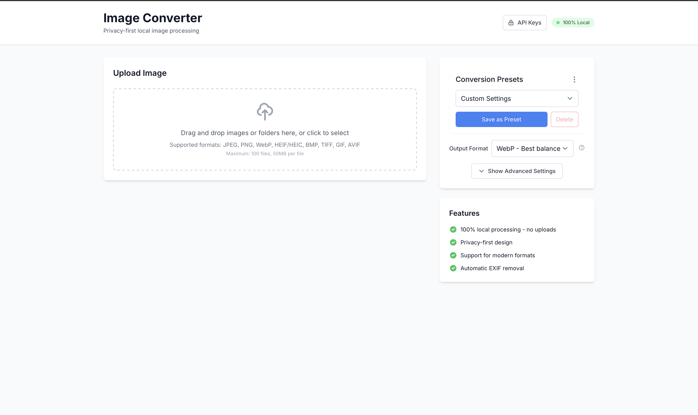
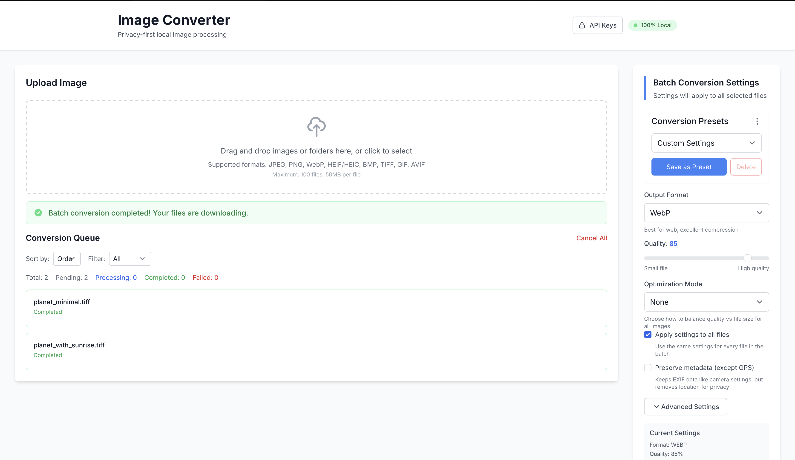
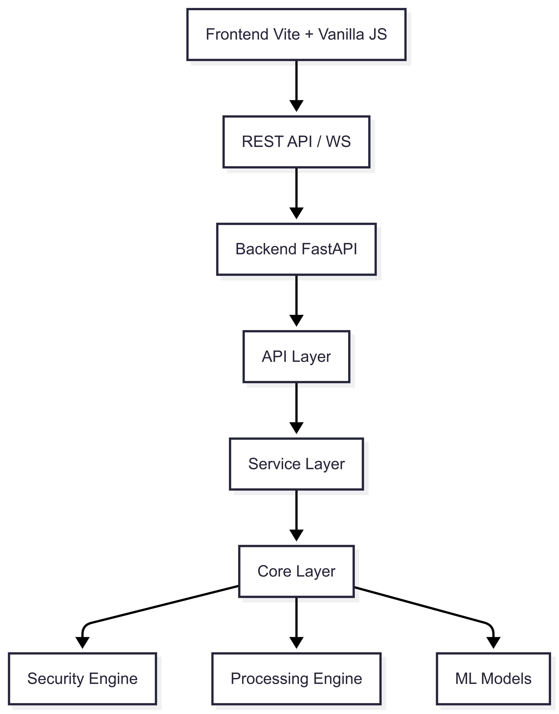

<div align="center">
  
  
  <h1>Next-Gen Image Format Converter & Optimizer</h1>
  
  <p>
    <strong>🔒 Privacy-First • 🚀 Lightning Fast • 🎯 AI-Powered • 🌐 Universal Format Support</strong>
  </p>
  
  <p>
    <a href="https://github.com/jnjambrin0/Next-Gen-Image-Format-Converter-Optimizer/blob/main/LICENSE">
      
    </a>
    <a href="https://github.com/jnjambrin0/Next-Gen-Image-Format-Converter-Optimizer/releases">
      
    </a>
    <a href="https://github.com/jnjambrin0/Next-Gen-Image-Format-Converter-Optimizer/stargazers">
      
    </a>
    <a href="https://github.com/jnjambrin0/Next-Gen-Image-Format-Converter-Optimizer/network/members">
      
    </a>
    <a href="https://github.com/jnjambrin0/Next-Gen-Image-Format-Converter-Optimizer/issues">
      
    </a>
    <a href="https://github.com/jnjambrin0/Next-Gen-Image-Format-Converter-Optimizer/pulls">
      
    </a>
  </p>

  <p>
    <a href="#-features">Features</a> •
    <a href="#-quick-start">Quick Start</a> •
    <a href="#-installation">Installation</a> •
    <a href="#-usage">Usage</a> •
    <a href="#-api">API</a> •
    <a href="#-contributing">Contributing</a> •
    <a href="#-license">License</a>
  </p>
</div>

---

## 🎯 Overview

**Next-Gen Image Format Converter & Optimizer** is a powerful, privacy-focused image conversion tool that runs entirely on your local machine. Built with security and performance in mind, it offers enterprise-grade image processing capabilities without compromising your data privacy.

### Why Choose This Tool?

- **🔐 100% Local Processing**: Your images never leave your machine
- **🚫 Zero Network Dependencies**: Works completely offline
- **🧠 AI-Powered Optimization**: Smart format recommendations based on content analysis
- **⚡ Blazing Fast**: Multi-threaded processing with hardware acceleration
- **🎨 Universal Format Support**: Convert between 15+ image formats
- **📦 Multiple Interfaces**: Web UI, CLI, REST API, and SDKs

<div align="center">
  
  <p><i>Clean and intuitive web interface for easy image conversion</i></p>
</div>

---

## ✨ Features

### 🔒 Security & Privacy

<table>
<tr>
<td width="50%">

**Privacy-First Design**

- ✅ No external API calls
- ✅ No telemetry or tracking
- ✅ No cloud dependencies
- ✅ EXIF/metadata removal by default
- ✅ Secure memory clearing

</td>
<td width="50%">

**Enterprise Security**

- ✅ Process sandboxing
- ✅ Resource isolation
- ✅ Memory limits enforcement
- ✅ Path traversal protection
- ✅ Input validation & sanitization

</td>
</tr>
</table>

### 🚀 Core Capabilities

<details open>
<summary><b>📸 Image Conversion</b></summary>

- **Universal Format Support**: JPEG, PNG, WebP, AVIF, HEIF/HEIC, JPEG XL, WebP2, BMP, TIFF, GIF
- **Smart Detection**: Content-based format detection (not relying on extensions)
- **Quality Optimization**: Adaptive quality settings based on content type
- **Batch Processing**: Convert hundreds of images simultaneously
- **Preset Management**: Save and reuse conversion settings

</details>

<details>
<summary><b>🧠 AI-Powered Intelligence</b></summary>

- **Content Classification**: Automatically detects photos, illustrations, screenshots, documents
- **Format Recommendations**: AI suggests optimal format based on content analysis
- **Face Detection**: Preserves quality in regions with faces
- **Text Detection**: Optimizes for readability in text-heavy images
- **Quality Analysis**: SSIM/PSNR metrics for quality validation

</details>

<details>
<summary><b>⚡ Performance</b></summary>

- **Multi-threaded Processing**: Utilizes all CPU cores efficiently
- **Hardware Acceleration**: GPU support where available
- **Smart Caching**: Intelligent caching for repeated operations
- **Streaming Support**: Handle large files without loading into memory
- **Progressive Processing**: Real-time progress updates

</details>

---

## 🎯 Supported Formats

<table>
<thead>
<tr>
<th>Format</th>
<th>Input</th>
<th>Output</th>
<th>Transparency</th>
<th>Animation</th>
<th>Best For</th>
</tr>
</thead>
<tbody>
<tr>
<td><b>JPEG</b></td>
<td>✅</td>
<td>✅</td>
<td>❌</td>
<td>❌</td>
<td>Photos, complex images</td>
</tr>
<tr>
<td><b>PNG</b></td>
<td>✅</td>
<td>✅</td>
<td>✅</td>
<td>❌</td>
<td>Graphics, screenshots, transparency</td>
</tr>
<tr>
<td><b>WebP</b></td>
<td>✅</td>
<td>✅</td>
<td>✅</td>
<td>✅</td>
<td>Web images, all-purpose</td>
</tr>
<tr>
<td><b>AVIF</b></td>
<td>✅</td>
<td>✅</td>
<td>✅</td>
<td>✅</td>
<td>Next-gen web, high compression</td>
</tr>
<tr>
<td><b>HEIF/HEIC</b></td>
<td>✅</td>
<td>✅</td>
<td>✅</td>
<td>✅</td>
<td>Apple ecosystem, photos</td>
</tr>
<tr>
<td><b>JPEG XL</b></td>
<td>❌</td>
<td>✅</td>
<td>✅</td>
<td>✅</td>
<td>Future-proof, lossless</td>
</tr>
<tr>
<td><b>JPEG 2000</b></td>
<td>❌</td>
<td>✅</td>
<td>✅</td>
<td>❌</td>
<td>Professional imaging</td>
</tr>
<tr>
<td><b>WebP2</b></td>
<td>❌</td>
<td>✅</td>
<td>✅</td>
<td>✅</td>
<td>Experimental next-gen</td>
</tr>
<tr>
<td><b>GIF</b></td>
<td>✅</td>
<td>❌</td>
<td>✅</td>
<td>✅</td>
<td>Simple animations</td>
</tr>
<tr>
<td><b>BMP</b></td>
<td>✅</td>
<td>❌</td>
<td>❌</td>
<td>❌</td>
<td>Legacy systems</td>
</tr>
<tr>
<td><b>TIFF</b></td>
<td>✅</td>
<td>❌</td>
<td>✅</td>
<td>❌</td>
<td>Professional photography</td>
</tr>
</tbody>
</table>

---

## 🚀 Quick Start

### 🌐 Web Interface

```bash
# Start the backend server
cd backend
python -m venv .venv
source .venv/bin/activate  # On Windows: .venv\Scripts\activate
pip install -r requirements.txt
uvicorn app.main:app --reload --port 8000

# In another terminal, start the frontend
cd frontend
npm install
npm run dev
```

Open http://localhost:5173 in your browser.

### 💻 Command Line

```bash
# Install CLI
cd backend
pip install -e .

# Convert a single image
img convert file photo.jpg -f webp -o photo.webp

# Batch conversion
img batch convert "*.png" -f avif --quality 85

# AI-powered optimization
img optimize auto photo.jpg --preset web
```

### 🔧 API

```python
# Python SDK
from image_converter import ImageConverterClient

client = ImageConverterClient(host="localhost", port=8000)
result, output_data = client.convert_image(
    "photo.jpg",
    output_format="webp",
    quality=85
)
```

---

## 📦 Installation

### Prerequisites

- **Python**: 3.11 or higher
- **Node.js**: 18 or higher (for web interface)
- **Git**: For cloning the repository

### Full Installation

<details>
<summary><b>🐧 Linux / macOS</b></summary>

```bash
# Clone the repository
git clone https://github.com/jnjambrin0/Next-Gen-Image-Format-Converter-Optimizer.git
cd Next-Gen-Image-Format-Converter-Optimizer

# Backend setup
cd backend
python3 -m venv .venv
source .venv/bin/activate
pip install -r requirements.txt

# Frontend setup (optional for Web UI)
cd ../frontend
npm install
npm run build

# Run the application
cd ../backend
uvicorn app.main:app --host 0.0.0.0 --port 8000
```

</details>

<details>
<summary><b>🪟 Windows</b></summary>

```powershell
# Clone the repository
git clone https://github.com/jnjambrin0/Next-Gen-Image-Format-Converter-Optimizer.git
cd Next-Gen-Image-Format-Converter-Optimizer

# Backend setup
cd backend
python -m venv .venv
.venv\Scripts\activate
pip install -r requirements.txt

# Frontend setup (optional for Web UI)
cd ..\frontend
npm install
npm run build

# Run the application
cd ..\backend
uvicorn app.main:app --host 0.0.0.0 --port 8000
```

</details>

<details>
<summary><b>🐳 Docker</b></summary>

```bash
# Using Docker Compose (recommended)
docker-compose up -d

# Or build manually
docker build -t image-converter .
docker run -p 8000:8000 -p 5173:5173 image-converter
```

</details>

---

## 💡 Usage Examples

### Web Interface

<div align="center">
  
  <p><i>Real-time conversion with progress tracking</i></p>
</div>

1. **Open** http://localhost:5173 in your browser
2. **Drag & Drop** images or click to browse
3. **Select** output format and quality settings
4. **Convert** and download results

### Command Line Interface

<details>
<summary><b>Basic Conversion</b></summary>

```bash
# Simple conversion
img convert file input.jpg -f webp -o output.webp

# With quality setting
img convert file photo.png -f avif --quality 90 -o photo.avif

# Preserve metadata
img convert file image.jpg -f webp --preserve-metadata -o image.webp
```

</details>

<details>
<summary><b>Batch Processing</b></summary>

```bash
# Convert all PNG files to WebP
img batch convert "*.png" -f webp --quality 85

# Recursive conversion with pattern
img batch convert "**/*.jpg" -f avif --recursive

# With custom output directory
img batch convert "*.heic" -f jpeg --output-dir converted/
```

</details>

<details>
<summary><b>Smart Optimization</b></summary>

```bash
# Auto-optimize for web
img optimize auto photo.jpg --preset web

# Optimize for print
img optimize auto image.png --preset print

# Custom optimization
img optimize auto pic.jpg --mode balanced --target-size 500KB
```

</details>

<details>
<summary><b>Analysis & Information</b></summary>

```bash
# Analyze image content
img analyze photo.jpg

# Get format recommendations
img recommend image.png --use-case web

# List supported formats
img formats --detailed
```

</details>

### Python SDK

<details>
<summary><b>Synchronous Client</b></summary>

```python
from image_converter import ImageConverterClient

# Initialize client
client = ImageConverterClient(
    host="localhost",
    port=8000,
    api_key="your-api-key"  # Optional
)

# Simple conversion
result, output_data = client.convert_image(
    "input.jpg",
    output_format="webp",
    quality=85
)

# Save the result
with open("output.webp", "wb") as f:
    f.write(output_data)

# Batch conversion
job = client.batch_convert(
    ["image1.jpg", "image2.png", "image3.heic"],
    output_format="avif",
    quality=90
)

# Monitor progress
while job.status != "completed":
    progress = client.get_batch_status(job.id)
    print(f"Progress: {progress.completed}/{progress.total}")
    time.sleep(1)
```

</details>

<details>
<summary><b>Asynchronous Client</b></summary>

```python
import asyncio
from image_converter import AsyncImageConverterClient

async def convert_images():
    async with AsyncImageConverterClient(
        host="localhost",
        port=8000
    ) as client:
        # Parallel conversions
        tasks = [
            client.convert_image(f"image{i}.jpg", "webp")
            for i in range(10)
        ]
        results = await asyncio.gather(*tasks)

        # AI-powered optimization
        optimized = await client.optimize_image(
            "photo.jpg",
            mode="quality",
            content_aware=True
        )

asyncio.run(convert_images())
```

</details>

### JavaScript/TypeScript SDK

```javascript
import { ImageConverterClient } from "image-converter-sdk";

const client = new ImageConverterClient({
  host: "localhost",
  port: 8000,
});

// Convert with promise
client
  .convertImage("photo.jpg", {
    outputFormat: "webp",
    quality: 85,
  })
  .then((result) => {
    console.log("Conversion complete:", result);
  });

// Async/await syntax
async function batchConvert() {
  const job = await client.createBatchJob({
    files: ["img1.jpg", "img2.png"],
    outputFormat: "avif",
  });

  // Real-time progress via WebSocket
  job.on("progress", (data) => {
    console.log(`Progress: ${data.completed}/${data.total}`);
  });

  await job.waitForCompletion();
}
```

### REST API

<details>
<summary><b>Single Image Conversion</b></summary>

```bash
# Convert image via API
curl -X POST http://localhost:8000/api/v1/convert \
  -F "file=@photo.jpg" \
  -F "output_format=webp" \
  -F "quality=85" \
  --output converted.webp
```

```python
# Python with requests
import requests

with open('photo.jpg', 'rb') as f:
    response = requests.post(
        'http://localhost:8000/api/v1/convert',
        files={'file': f},
        data={
            'output_format': 'webp',
            'quality': 85
        }
    )

with open('output.webp', 'wb') as f:
    f.write(response.content)
```

</details>

---

## 🏗️ Architecture

<div align="center">
  
  <p><i>High-level system architecture</i></p>
</div>

### System Components

```
┌─────────────────────────────────────────────────────────────┐
│               Frontend (Vite + Vanilla JS)                  │
│    ┌─────────┐  ┌─────────┐  ┌──────────┐  ┌───────────┐    │
│    │    UI   │  │  State  │  │ WebSocket│  │  Workers  │    │
│    │  Comps  │  │ Manager │  │  Client  │  │   Pool    │    │
│    └─────────┘  └─────────┘  └──────────┘  └───────────┘    │
└─────────────────────────────────────────────────────────────┘
                              │
                        REST API / WS
                              │
┌─────────────────────────────────────────────────────────────┐
│                      Backend (FastAPI)                      │
│      ┌──────────────────────────────────────────────────┐   │
│      │                   API Layer                      │   │
│      │    ┌──────────┐  ┌──────────┐  ┌──────────┐      │   │
│      │    │ Routes   │  │Middleware│  │WebSockets│      │   │
│      │    └──────────┘  └──────────┘  └──────────┘      │   │
│      └──────────────────────────────────────────────────┘   │
│                                                             │
│      ┌──────────────────────────────────────────────────    │
│      │                Service Layer                     │   │
│      │  ┌──────────┐  ┌──────────┐  ┌──────────┐        │   │
│      │  │Conversion│  │  Intel   │  │  Batch   │        │   │
│      │  │ Service  │  │ Service  │  │ Service  │        │   │
│      │  └──────────┘  └──────────┘  └──────────┘        │   │
│      └──────────────────────────────────────────────────┘   │
│                                                             │
│      ┌──────────────────────────────────────────────────┐   │
│      │                  Core Layer                      │   │
│      │    ┌──────────┐  ┌──────────┐  ┌──────────┐      │   │
│      │    │ Security │  │Processing│  │    ML    │      │   │
│      │    │  Engine  │  │  Engine  │  │  Models  │      │   │
│      │    └──────────┘  └──────────┘  └──────────┘      │   │
│      └──────────────────────────────────────────────────┘   │
└─────────────────────────────────────────────────────────────┘
```

### Security Architecture

<div align="center">
  
  <p><i>Multi-layer security architecture</i></p>
</div>

- **Process Isolation**: Each conversion runs in a sandboxed subprocess
- **Resource Limits**: CPU, memory, and time constraints enforced
- **Input Validation**: All inputs sanitized and validated
- **Memory Security**: Secure clearing with 5-pass overwrite
- **Network Isolation**: No external network access allowed

---

## 🧪 Testing

### Running Tests

```bash
# Backend tests
cd backend
pytest                          # All tests
pytest tests/unit/             # Unit tests only
pytest tests/integration/      # Integration tests
pytest tests/security/         # Security tests
pytest --cov=app              # With coverage

# Frontend tests
cd frontend
npm test                       # Run tests
npm run test:coverage         # With coverage
npm run test:ui               # Interactive UI
```

### Test Coverage

| Component       | Coverage | Status       |
| --------------- | -------- | ------------ |
| Backend Core    | 92%      | ✅ Excellent |
| API Routes      | 88%      | ✅ Good      |
| Security Module | 95%      | ✅ Excellent |
| Frontend UI     | 85%      | ✅ Good      |
| CLI             | 78%      | 🔄 Improving |

---

## 📊 Performance Benchmarks

<table>
<thead>
<tr>
<th>Operation</th>
<th>File Size</th>
<th>Time</th>
<th>Memory</th>
<th>CPU</th>
</tr>
</thead>
<tbody>
<tr>
<td>JPEG → WebP</td>
<td>5MB</td>
<td>0.8s</td>
<td>45MB</td>
<td>35%</td>
</tr>
<tr>
<td>PNG → AVIF</td>
<td>10MB</td>
<td>1.2s</td>
<td>85MB</td>
<td>60%</td>
</tr>
<tr>
<td>Batch (100 files)</td>
<td>500MB total</td>
<td>12s</td>
<td>320MB</td>
<td>85%</td>
</tr>
<tr>
<td>AI Analysis</td>
<td>5MB</td>
<td>0.3s</td>
<td>150MB</td>
<td>40%</td>
</tr>
</tbody>
</table>

_Tested on: Intel i7-10700K, 16GB RAM, Ubuntu 22.04_

---

## 🛠️ Development

### Project Structure

```
image_converter/
├── backend/                  # FastAPI backend
│   ├── app/                 # Application code
│   │   ├── api/            # API routes & middleware
│   │   ├── core/           # Core business logic
│   │   ├── services/       # Service layer
│   │   └── cli/            # CLI implementation
│   ├── tests/              # Test suite
│   └── ml_models/          # AI models
├── frontend/                # Web interface
│   ├── src/               # Source code
│   │   ├── components/    # UI components
│   │   ├── services/      # API services
│   │   └── utils/         # Utilities
│   └── dist/              # Build output
├── sdks/                   # Language SDKs
│   ├── python/            # Python SDK
│   ├── javascript/        # JS/TS SDK
│   └── go/               # Go SDK
├── docs/                   # Documentation
└── scripts/               # Utility scripts
```

### Development Setup

```bash
# Clone repository
git clone https://github.com/jnjambrin0/Next-Gen-Image-Format-Converter-Optimizer.git
cd Next-Gen-Image-Format-Converter-Optimizer

# Install pre-commit hooks
pip install pre-commit
pre-commit install

# Backend development
cd backend
pip install -r requirements-dev.txt
uvicorn app.main:app --reload

# Frontend development
cd frontend
npm install
npm run dev

# Run formatters
black backend/         # Python formatting
npm run format        # JS/CSS formatting
```

### Environment Variables

Create `.env` files for configuration:

**Backend (.env)**

```env
# API Configuration
API_PORT=8000
API_HOST=0.0.0.0
ENV=development

# Security
ENABLE_SANDBOXING=true
SANDBOX_STRICTNESS=standard
NETWORK_VERIFICATION_ENABLED=true

# Performance
MAX_WORKERS=10
MAX_FILE_SIZE_MB=50
CONVERSION_TIMEOUT=30

# Logging
LOG_LEVEL=INFO
LOG_DIR=./logs
```

**Frontend (.env)**

```env
# API Connection
VITE_API_HOST=localhost
VITE_API_PORT=8000

# Features
VITE_ENABLE_BATCH=true
VITE_ENABLE_WEBSOCKET=true
```

---

## 🤝 Contributing

We love contributions! Please see our [Contributing Guide](CONTRIBUTING.md) for details.

### Quick Contribution Guide

1. **Fork** the repository
2. **Create** a feature branch (`git checkout -b feature/AmazingFeature`)
3. **Commit** your changes (`git commit -m 'Add AmazingFeature'`)
4. **Push** to the branch (`git push origin feature/AmazingFeature`)
5. **Open** a Pull Request

### Code Style

- **Python**: Black formatter, PEP 8 compliant
- **JavaScript**: Prettier, ESLint rules
- **Commits**: Conventional Commits format

### Priority Areas

- 🎯 Additional format support (RAW, HDR)
- 🚀 Performance optimizations
- 🌍 Internationalization (i18n)
- 📱 Mobile app development
- 🧪 Test coverage improvements

---

## 📚 Documentation

### API Documentation

- **Swagger UI**: http://localhost:8000/api/docs
- **ReDoc**: http://localhost:8000/api/redoc
- **OpenAPI Schema**: http://localhost:8000/api/openapi.json

### Guides & Tutorials

- [Installation Guide](docs/INSTALLATION.md)
- [API Reference](docs/API.md)
- [CLI Reference](docs/CLI.md)
- [SDK Documentation](docs/SDK.md)
- [Security Guide](docs/SECURITY.md)
- [Performance Tuning](docs/PERFORMANCE.md)

---

## 🗺️ Roadmap

### Version 1.0 (Current)

- ✅ Core conversion functionality
- ✅ Web interface
- ✅ CLI tool
- ✅ REST API
- ✅ Python SDK
- ✅ Batch processing
- ✅ AI content detection

### Version 1.1 (Q2 2025)

- 🔄 JavaScript/TypeScript SDK
- 🔄 Go SDK
- 🔄 WebAssembly support
- 🔄 Browser extension
- 🔄 Advanced presets

### Version 2.0 (Q3 2025)

- 📋 RAW format support
- 📋 HDR image handling
- 📋 Video format conversion
- 📋 Cloud deployment options
- 📋 Mobile applications

### Future Considerations

- 🔮 Blockchain verification
- 🔮 Distributed processing
- 🔮 AI upscaling
- 🔮 3D format support

---

## 🙏 Acknowledgments

### Technologies Used

- **[FastAPI](https://fastapi.tiangolo.com/)** - Modern web framework
- **[Pillow](https://pillow.readthedocs.io/)** - Image processing
- **[ONNX Runtime](https://onnxruntime.ai/)** - ML inference
- **[Vite](https://vitejs.dev/)** - Frontend tooling
- **[Typer](https://typer.tiangolo.com/)** - CLI framework

### Contributors

<a href="https://github.com/jnjambrin0/Next-Gen-Image-Format-Converter-Optimizer/graphs/contributors">
  
</a>

### Special Thanks

- The open-source community for invaluable libraries and tools
- Early adopters and testers for feedback and bug reports
- Contributors for code, documentation, and ideas

---

## 📄 License

This project is licensed under the MIT License - see the [LICENSE](LICENSE) file for details.

```
MIT License

Copyright (c) 2025 Image Converter Contributors

Permission is hereby granted, free of charge, to any person obtaining a copy
of this software and associated documentation files (the "Software"), to deal
in the Software without restriction, including without limitation the rights
to use, copy, modify, merge, publish, distribute, sublicense, and/or sell
copies of the Software, and to permit persons to whom the Software is
furnished to do so, subject to the following conditions:

The above copyright notice and this permission notice shall be included in all
copies or substantial portions of the Software.

THE SOFTWARE IS PROVIDED "AS IS", WITHOUT WARRANTY OF ANY KIND, EXPRESS OR
IMPLIED, INCLUDING BUT NOT LIMITED TO THE WARRANTIES OF MERCHANTABILITY,
FITNESS FOR A PARTICULAR PURPOSE AND NONINFRINGEMENT. IN NO EVENT SHALL THE
AUTHORS OR COPYRIGHT HOLDERS BE LIABLE FOR ANY CLAIM, DAMAGES OR OTHER
LIABILITY, WHETHER IN AN ACTION OF CONTRACT, TORT OR OTHERWISE, ARISING FROM,
OUT OF OR IN CONNECTION WITH THE SOFTWARE OR THE USE OR OTHER DEALINGS IN THE
SOFTWARE.
```

---

## 📞 Support & Contact

### Getting Help

- 📖 [Documentation](https://github.com/jnjambrin0/Next-Gen-Image-Format-Converter-Optimizer/wiki)
- 💬 [Discussions](https://github.com/jnjambrin0/Next-Gen-Image-Format-Converter-Optimizer/discussions)
- 🐛 [Issue Tracker](https://github.com/jnjambrin0/Next-Gen-Image-Format-Converter-Optimizer/issues)
- 📧 Email: [jnjambrin0@github.com](mailto:jnjambrin0@github.com)

### Social

- 🐦 Twitter: [@jnjambrin0](https://twitter.com/jnjambrin0)
- 💼 LinkedIn: [jnjambrin0](https://linkedin.com/in/jnjambrin0)
- 🌐 Website: [jnjambrin0.dev](https://jnjambrin0.dev)

---

<div align="center">
  <br />
  <p>
    <b>Made with ❤️ by <a href="https://github.com/jnjambrin0">jnjambrin0</a> and contributors</b>
  </p>
  <p>
    <i>If you find this project useful, please consider giving it a ⭐!</i>
  </p>
</div>
